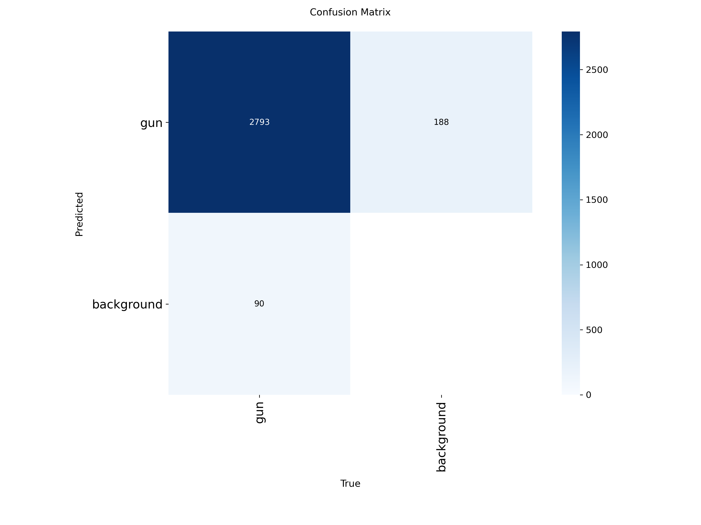
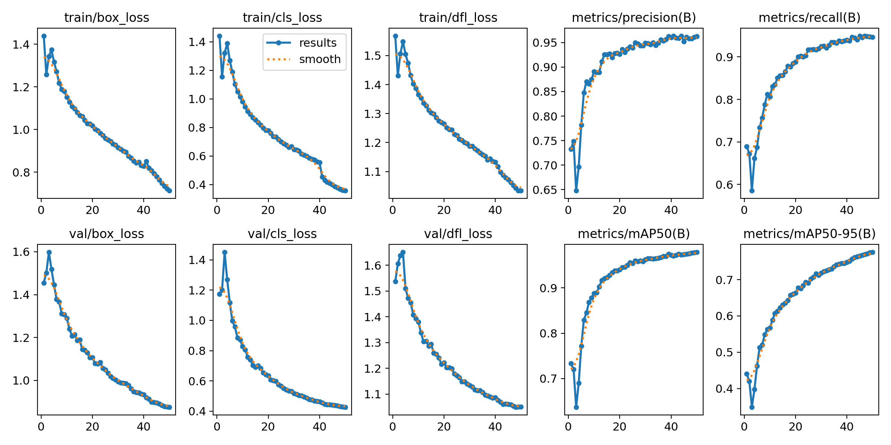

# Weapon Detection from Body-Cam using GenAI & YOLOv8

**Authors:** Hen Golyan, Aviv Heller, Afik Suissa  
**Course:** Deep Generative Models for Audio-Visual Data (Semester A)

# Weapon Detection from Body-Cam Footage using GenAI & Synthetic Data

## 📌 Project Motivation
In military and public safety sectors, situational awareness is critical. Body-worn cameras are standard equipment, but analyzing hours of footage manually is inefficient. Automated weapon detection can enhance real-time situational awareness and streamline post-event analysis.

## ❓ Problem Statement
Developing robust detection models for body-cam footage is challenging due to:
1.  **Data Scarcity:** High-quality, diverse datasets of firearms in body-cam perspectives are rare or classified.
2.  **Environmental Challenges:** Body-cam footage suffers from unique distortions such as fisheye lens effects, motion blur, low lighting, and grain/noise.
3.  **Contextual Complexity:** Standard GenAI models (like Stable Diffusion) often fail to generate weapons accurately in complex or unusual scenes (e.g., surgeries, card games).

## 🖼️ Visual Abstract
Our approach combines real-world data with a custom synthetic dataset generation pipeline:
1.  **Data Collection:** Gathering weapon images.
2.  **Synthetic Generation:** Using Image Compositing to place weapons on diverse backgrounds.
3.  **Realism Pass:** Applying "Body-Cam" effects (Fisheye, Blur, Noise).
4.  **Training:** Fine-tuning YOLOv8s on the hybrid dataset.

## 📂 Datasets Used & Collected
Since no adequate dataset existed for our specific needs, we created a custom dataset by combining real-world data with our synthetic generation pipeline.

We utilized and augmented data from the following sources:
* **Bodycam Dataset (Roboflow):** [Link to Dataset](https://universe.roboflow.com/tochukwu/bodycam/dataset/2)
* **CS 231n Project Dataset (Roboflow):** [Link to Dataset](https://universe.roboflow.com/dana-q9plh/cs-231n-project/dataset/2#)
* **Syntethic & Augmented data:** [Link to Dataset](https://drive.google.com/drive/folders/1mOxLCc2QptTAp3o44nBeX-FQUYfLkGB3?usp=sharing) 

## 🛠️ Data Augmentation & Generation Methods
To tackle data scarcity, we experimented with two generative approaches:

### 1. Stable Diffusion (Inpainting)
Initially, we used Generative AI to inpaint weapons into scenes. However, we found that the model struggled to accurately place weapons in unusual contexts (e.g., operating rooms), resulting in hallucinations and low fidelity.

### 2. Image Compositing (Selected Method)
We found **Image Compositing** to be superior for our needs. We manually extracted high-quality weapon images and overlaid them onto various background images.
To mimic the "Body-Cam look," we applied a **"Realism Pass"**:
* **Fisheye Distortion:** Simulating wide-angle lenses.
* **Motion Blur:** Simulating wearer movement.
* **Noise/Grain:** Simulating low-light sensor noise.

This approach ensured high data quality and 100% precise labeling.

## 🧠 Models and Pipelines
* **Architecture:** YOLOv8s (Small)
* **Reasoning:** Selected for its balance between high accuracy and fast inference speed, suitable for edge devices.
* **Pipeline:**
    1.  Input Image (Real or Synthetic).
    2.  Preprocessing & Resizing.
    3.  YOLOv8 Inference.
    4.  Output: Bounding Box + Confidence Score.

## ⚙️ Training Process & Parameters
* **Epochs:** 50
* **Batch Size:** 16
* **Optimizer:** SGD / AdamW (Auto)
* **Hardware:** NVIDIA T4 GPU
* **Dataset Size:** ~15,600 Images (Real + Synthetic).

## 📊 Metrics & Results
We achieved a significant performance boost by switching from pure GenAI augmentation to our Compositing + Fine-tuning strategy.

| Metric | Interim Results (Baseline) | **Final Results** |
| :--- | :--- | :--- |
| **mAP50** | 53.2% | **97.9%** |
| **Precision** | 69.2% | **96.2%** |
| **Recall** | 50.8% | **94.6%** |
| **Inference Speed** | 5.4 ms | **4.5 ms** |

*Table 1: Comparison between initial training and final fine-tuned model.*

### Confusion Matrix
Our model shows extremely low false-positive rates (Background incorrectly identified as Gun: 0%).



## 📷 Input/Output Examples
The model successfully detects weapons even in unseen images with challenging angles and lighting.


*(Example: Unseen image from a body-cam perspective successfully detected)*

## 📂 Repository Structure
```bash
├── datasets/             # Scripts for downloading/processing data
├── results/
│   ├── interim/          # Results from early development stages
│   └── final/            # Final training metrics, confusion matrix, and plots
├── weights/              # Best trained model weights (best.pt)
├── train.py              # Training script
├── predict.py            # Inference script
└── README.md             # Project documentation
